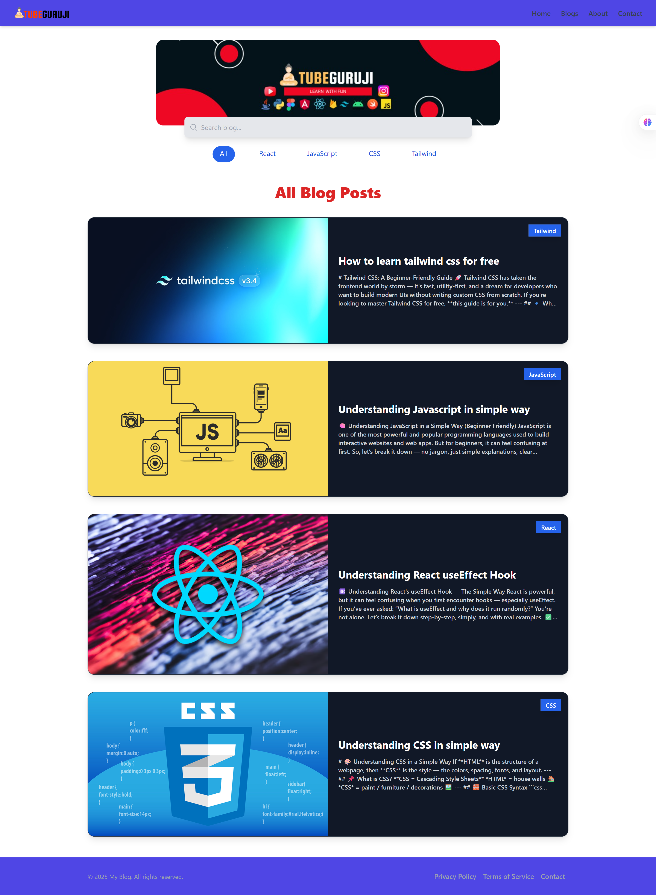

# React Blog App with Vite, Tailwind CSS, Firebase

A simple and modern blog website where users can view posts fetched from Firebase Firestore. Each post supports Markdown formatting. The app is styled with Tailwind CSS and built using React with Vite.

## Features

- View all blog posts in a grid
- Click to open a single blog post page
- Markdown rendering for post content
- Responsive design (mobile and desktop)
- React Router for navigation
- Firebase Firestore integration for storing posts

## Tech Stack

- React
- Vite
- Tailwind CSS
- Firebase (Firestore)
- React Router
- React Markdown

## Installation

1. **Clone the repository**
   ```bash
   git clone https://github.com/your-username/your-repo-name.git
   cd your-repo-name
   ```

2. **Install dependencies**
   ```bash
   npm install
   ```

3. **Create a `.env` file with your Firebase config**
   ```env
   VITE_API_KEY=your_api_key
   VITE_AUTH_DOMAIN=your_auth_domain
   VITE_PROJECT_ID=your_project_id
   VITE_STORAGE_BUCKET=your_storage_bucket
   VITE_MESSAGING_SENDER_ID=your_messaging_sender_id
   VITE_APP_ID=your_app_id
   ```

4. **Run the development server**
   ```bash
   npm run dev
   ```

## Folder Structure

```
src/
  components/    # Reusable UI components (Header, Footer, BlogList, etc.)
  pages/         # Page components (Home, SinglePost, etc.)
  assets/        # Images and static assets
  FireBase.js    # Firebase configuration
  App.jsx        # Main App component
  main.jsx       # Entry point
```

## Screenshots

.png)



## Live Demo

[https://my-react-blog.web.app](https://my-react-blog.web.app)

## License

MIT

## Author

[Prakyath P Karkera](https://github.com/yourusername)
